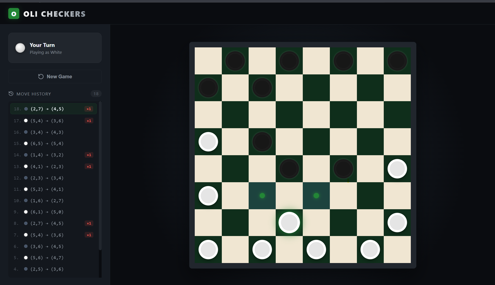

# MCTS Checkers

A modern, AI‑powered checkers game built with **Monte‑Carlo Tree Search (MCTS)** for the engine and **FastAPI** + **React** for the web interface.

---



###  Architecture Overview


## Quick Start
1. **Clone the repo**
   ```bash
   git clone <repo‑url>
   cd MCTS_checkers
   ```
2. **Backend**
   ```bash
   cd backend
   python -m venv .venv
   .venv\Scripts\activate   # Windows
   pip install -r requirements.txt
   uvicorn main:app --reload   # http://127.0.0.1:8000
   ```
3. **Frontend**
   ```bash
   cd ../frontend
   npm install
   npm start                     # http://localhost:3000
   ```
4. Open the browser at the frontend URL; the UI will communicate with the FastAPI backend automatically (CORS is pre‑configured).

---

## 🐳 Docker Development 
### Build Images
```bash
# From the project root
docker compose build
```
### Run Containers
```bash
docker compose up
```
The backend will be reachable at `http://localhost:8000` and the frontend at `http://localhost:3000`.

### Stop & Clean
```bash
docker compose down -v   # removes containers & volumes
```

---

##   How to Play
- The board is rendered in the **Board** component.
- Click a piece to select it, then click a destination square.
- After your move, the MCTS algorithm automatically makes its move via the `/game/{id}/ai-move` endpoint.
- The game ends when a player has no legal moves.

---
##  Project Structure
```
MCTS_checkers/
├─ backend/                # FastAPI server & MCTS engine
│   ├─ api/               # API routers
│   ├─ engine/            # Game logic (MCTS, board, moves)
│   ├─ Dockerfile         # Container for the backend
│   └─ requirements.txt   # Python dependencies
├─ frontend/               # React UI
│   ├─ src/               # Source code (components, styles)
│   └─ Dockerfile         # Container for the frontend
├─ architecture.txt        # High‑level design description
└─ README.md               # **You are reading it!**
```

---

##development Notes
- **MCTS Engine** lives in `backend/engine/`.  Core classes: `Game`, `Move`, and `constants`.
- **API** routes are defined under `backend/api/` and expose endpoints for creating games, retrieving state, and triggering the AI.
- **Frontend** uses React functional components with hooks; styling is pure CSS (no Tailwind).
- **CORS** is enabled for `http://localhost:3000` in `backend/main.py`.

---

## 📦 Dependencies
### Backend (Python)
- fastapi
- uvicorn[standard]
- pydantic
- numpy
- (MCTS implementation is custom)

### Frontend (Node)
- react
- react‑dom
- axios (for API calls)

---


